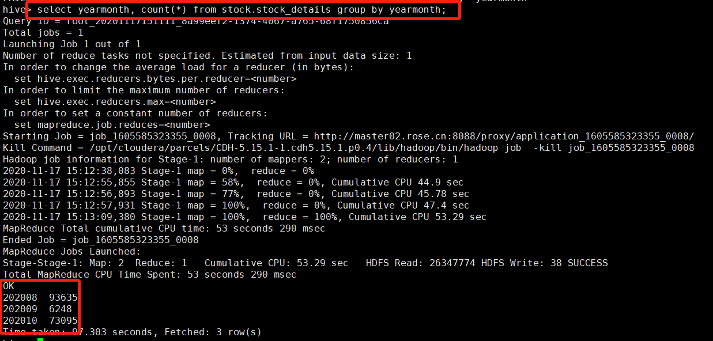
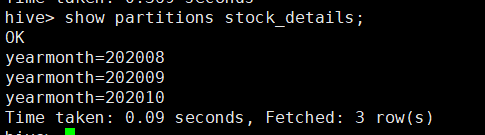
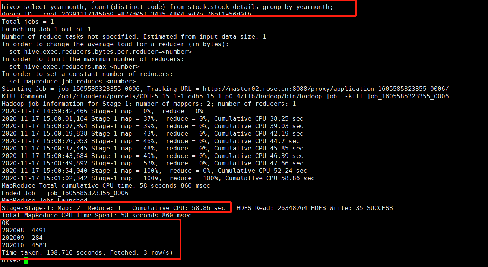
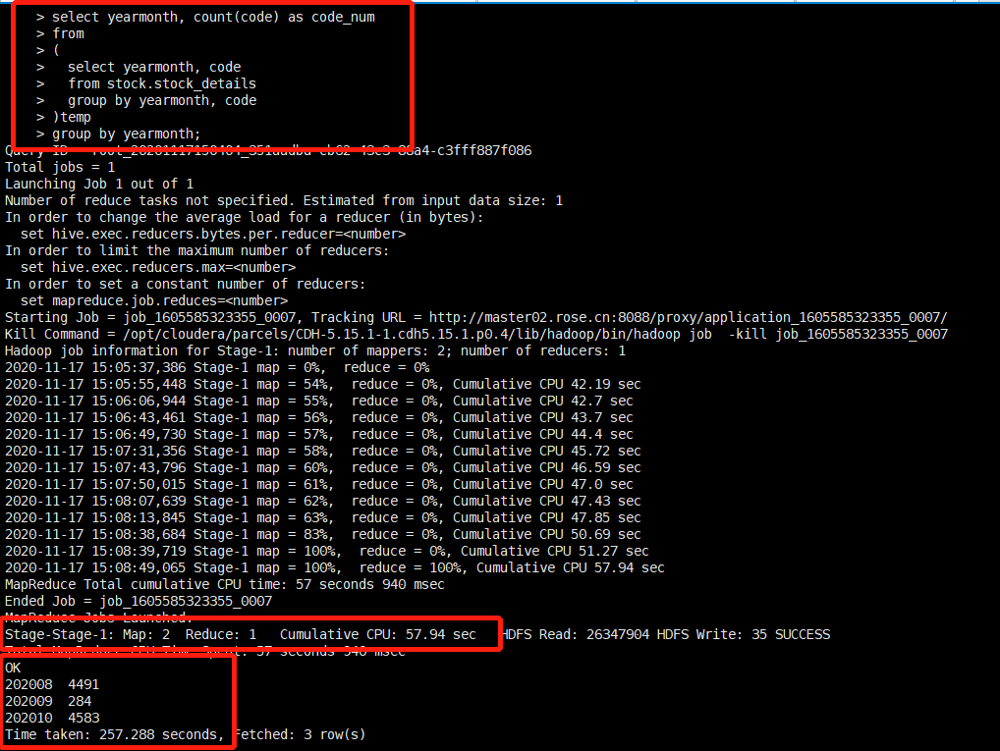
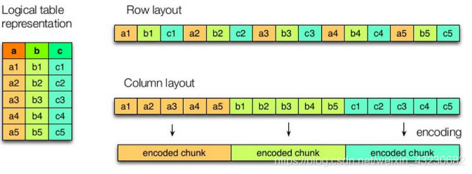
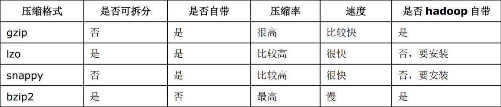

# Hive SQL的优化

#### 一、概述

##### 1.1 hive的特征：

1. 可以通过SQL轻松访问数据的工具，从而实现数据仓库任务，如提取/转换/加载（ETL），报告和数据分析；
2. 它可以使已经存储的数据结构化；
3. 可以直接访问存储在Apache HDFS或其他数据存储系统（如Apache HBase）中的文件；
4. Hive除了支持MapReduce计算引擎，还支持Spark和Tez这两种分布式计算引擎；
5. 它提供类似sql的查询语句HiveQL对数据进行分析处理；
6. 数据的存储格式有多种，比如数据源是二进制格式，普通文本格式等等；

##### 1.2 hive的优势：

　　hive强大之处不要求数据转换成特定的格式，而是利用hadoop本身InputFormat API来从不同的数据源读取数据，同样地使用OutputFormat API将数据写成不同的格式。所以对于不同的数据源，或者写出不同的格式就需要不同的对应的InputFormat和OutputFormat类的实现。以stored as textFile为例，其在底层java API中表现是输入InputFormat格式：TextInputFormat以及输出OutputFormat格式：HiveIgnoreKeyTextOutputFormat。这里InputFormat中定义了如何对数据源文本进行读取划分，以及如何将切片分割成记录存入表中。而OutputFormat定义了如何将这些切片写回到文件里或者直接在控制台输出。

　　Hive拥有统一的元数据管理，所以和Spark、Impala等SQL引擎是通用的。通用是指，在拥有了统一的metastore之后，在Hive中创建一张表，在Spark/Impala中是能用的；反之在Spark中创建一张表，在Hive中也是能用的，只需要共用元数据，就可以切换SQL引擎，涉及到了Spark sql和Hive On Spark。

　　不仅如此Hive使用SQL语法，提供快速开发的能力，还可以通过用户定义的函数（UDF），用户定义的聚合（UDAF）和用户定义的表函数（UDTF）进行扩展，避免了去写mapreducce，减少开发人员的学习成本。Hive中不仅可以使用逗号和制表符分隔值（CSV/TSV）文本文件，还可以使用Sequence File、RC、ORC、Parquet。Hive旨在最大限度地提高可伸缩性（通过向Hadoop集群动态添加更多机器扩展），性能，可扩展性，容错性以及与其输入格式的松散耦合。

　　数据离线处理，比如日志分析，海量数据结构化分析。

#### 二、Hive函数

Hive的SQL还可以通过用户定义的函数（UDF），用户定义的聚合（UDAF）和用户定义的表函数（UDTF）进行扩展。

当Hive提供的内置函数无法满足你的业务处理需要时，此时就可以考虑使用用户自定义函数（UDF）。

**UDF、UDAF、UDTF**的区别：

- UDF（User-Defined-Function）一进一出
- UDAF（User-Defined Aggregation Funcation）聚集函数，多进一出
- UDTF（User-Defined Table-Generating Functions）一进多出，如lateral view explore()


#### 三、Hive优化

##### 3.1慎用api

我们知道大数据场景下不害怕数据量大，害怕的是数据倾斜，怎样避免数据倾斜，找到可能产生数据倾斜的函数尤为关键，数据量较大的情况下，慎用count(distinct)，count(distinct)容易产生倾斜问题。





```sql
select yearmonth, count(distinct code) from stock.stock_details group by yearmonth;
```



数据量小的时候无所谓，数据量大的情况下，由于COUNT DISTINCT操作需要用一个Reduce Task来完成，这一个Reduce需要处理的数据量太大，就会导致整个Job很难完成，一般COUNT DISTINCT使用先GROUP BY再COUNT的方式替换：

```sql
select yearmonth, count(code) as code_num 
from 
(
  select yearmonth, code 
  from stock.stock_details
  group by yearmonth, code
)temp
group by yearmonth;
```



测试结果表明：明显改造后的语句比之前耗时，这时因为改造后的语句有2个SELECT，但是这样在数据量大的时候，数据不会存在倾斜问题。

##### 3.2 自定义UDAF函数优化

　　sum，count，max，min等UDAF，不怕数据倾斜问题，hadoop在map端汇总合并优化，使数据倾斜不成问题。

##### 3.3 设置合理的map reduce的task数量

###### 3.3.1 map阶段优化

```
mapred.min.split.size: 指的是数据的最小分割单元大小；min的默认值是1B
mapred.max.split.size: 指的是数据的最大分割单元大小；max的默认值是256MB

通过调整max可以起到调整map数的作用，减小max可以增加map数，增大max可以减少map数。
需要提醒的是，直接调整mapred.map.tasks这个参数是没有效果的。
```

 举例：

　　a) 假设input目录下有1个文件a，大小为780M，那么hadoop会将该文件a分隔成7个块（6个128M的块和1个12M的块），从而产生7个map书；

　　b) 假设input目录下有3个文件a,b,c，大小分别为10M，20M，130M，那么hadoop会分隔成4个块（10M，20M，128M，2M），从而产生4个map数；

　　注意：如果文件大于块大小（128M），那么会拆分，如果小于块大小，则把该文件当成一个块。

　　其实这就涉及到小文件的问题：如果一个任务有很多小文件（远远小于块大小128M），则每个小文件也会当做一个块，用一个map任务来完成。

　　而一个map任务启动和初始化的时间远远大于逻辑处理的时间，就会造成很大的资源浪费。而且，同时可执行的map数是受限的。那么，是不是保证每个map处理接近128M的文件块，就高枕无忧了？答案也是不一定。比如有一个127M的文件，正常会用一个map去完成，但这个文件只有一个或者两个小字段，却有几千万的记录，如果map处理的逻辑比较复杂，用一个map任务去做，肯定也比较耗时。 

​	以下有两种方法来解决：

- 减少map数量

```
假设一个SQL任务：
Select count(1) from popt_tbaccountcopy_meswhere pt = '2012-07-04';
该任务的inputdir :  /group/p_sdo_data/p_sdo_data_etl/pt/popt_tbaccountcopy_mes/pt=2012-07-04
共有194个文件，其中很多事远远小于128M的小文件，总大小9G，正常执行会用194个map任务。
Map总共消耗的计算资源：SLOTS_MILLIS_MAPS= 623,020

通过以下方法来在map执行前合并小文件，减少map数：
set mapred.max.split.size=100000000; #100M
set mapred.min.split.size.per.node=100000000;  
set mapred.min.split.size.per.rack=100000000;
set hive.input.format=org.apache.hadoop.hive.ql.io.CombineHiveInputFormat; #这个参数表示执行前进行小文件合并
再执行上面的语句，用了74个map任务，map消耗的计算资源：SLOTS_MILLIS_MAPS= 333,500
对于这个简单SQL任务，执行时间上可能差不多，但节省了一半的计算资源。

前面三个参数确定合并文件块的大小，大于文件块大小128m的，按照128m来分隔，
小于128m,大于100m的，按照100m来分隔，把那些小于100m的（包括小文件和分隔大文件剩下的），
进行合并,最终生成了74个块。
```

- 增大map数量

```
当input的文件都很大，任务逻辑复杂，map执行非常慢的时候，可以考虑增加Map数，
来使得每个map处理的数据量减少，从而提高任务的执行效率。

 假设有这样一个任务：
    Select data_desc,
           count(1),
           count(distinct id),
           sum(case when ...),
           sum(case when ...),
           sum(...)
    from a 
    group by data_desc

如果表a只有一个文件，大小为120M，但包含几千万的记录，如果用1个map去完成这个任务，肯定是比较耗时的，
这种情况下，我们要考虑将这一个文件合理的拆分成多个，
这样就可以用多个map任务去完成。
    set mapred.reduce.tasks=10;
    create table a_1 as 
      select * from a 
      distribute by rand(123);

这样会将a表的记录，随机的分散到包含10个文件的a_1表中，再用a_1代替上面sql中的a表，则会用10个map任务去完成。
每个map任务处理大于12M（几百万记录）的数据，效率肯定会好很多。
```

注意：看上去，貌似这两种有些矛盾，一个是要合并小文件，一个是要把大文件拆成小文件，这点正是重点需要关注的地方，使单个map任务处理合适的数据量；


###### 3.3.2 reduce阶段优化

　　Reduce的个数对整个作业的运行性能有很大影响。如果Reduce设置的过大，那么将会产生很多小文件，对NameNode会产生一定的影响，而且整个作业的运行时间未必会减少；如果Reduce设置的过小，那么单个Reduce处理的数据将会加大，很可能会引起OOM异常。

　　如果设置了mapred.reduce.tasks/mapreduce.job.reduces参数，那么Hive会直接使用它的值作为Reduce的个数；如果mapred.reduce.tasks/mapreduce.job.reduces的值没有设置（也就是-1），那么Hive会根据输入文件的大小估算出Reduce的个数。根据输入文件估算Reduce的个数可能未必很准确，因为Reduce的输入是Map的输出，而Map的输出可能会比输入要小，所以最准确的数根据Map的输出估算Reduce的个数。

1. **Hive自己如何确定reduce数：**

　　reduce个数的设定极大影响任务执行效率，不指定reduce个数的情况下，Hive会猜测确定一个reduce个数，基于以下两个设定：

　　①：hive.exec.reducers.bytes.per.reducer（每个reduce任务处理的数据量，默认为1000^3=1G）

　　②：hive.exec.reducers.max（每个任务最大的reduce数，默认为999）

　计算reducer数的公式很简单 N=min（参数②，总输入数据量/参数①）

　　即，如果reduce的输入（map的输出）总大小不超过1G，那么只会有一个reduce任务；

```
如：select pt,count(1) from popt_tbaccountcopy_mes where pt = '2012-07-04' group by pt; 
 
/group/p_sdo_data/p_sdo_data_etl/pt/popt_tbaccountcopy_mes/pt=2012-07-04 总大小为9G多，
  因此这句有10个reduce
```

2. **调整reduce个数方法一：**

　　调整hive.exec.reducers.bytes.per.reducer参数的值；

　　set hive.exec.reducers.bytes.per.reducer=500000000; （500M）

　　select pt, count(1) from popt_tbaccountcopy_mes where pt = '2012-07-04' group by pt;

　　这次有20个reduce

3. **调整reduce个数方法二：**

　　set mapred.reduce.tasks=15;

　　select pt,count(1) from popt_tbaccountcopy_mes where pt = '2012-07-04' group by pt;

　　这次有15个reduce

4. **reduce个数并不是越多越好；**

　　同map一样，启动和初始化reduce也会消耗时间和资源；

　　另外，有多少个reduce，就会有个多少个输出文件，如果生成了很多个小文件，那么如果这些小文件作为下一个任务的输入，则也会出现小文件过多的问题；

5. **什么情况下只有一个reduce；**

　　很多时候你会发现任务中不管数据量多大，不管你有没有调整reduce个数的参数，任务中一直都只有一个reduce任务；其实只有一个reduce任务的情况，除了数据量小于hive.exec.reducers.bytes.per.reducer参数值的情况外，还有以下原因：

- 没有group by的汇总，比如把select pt,count(1) from popt_tbaccountcopy_mes where pt = ‘2012-07-04’ group by pt; 写成select count(1) from popt_tbaccountcopy_mes where pt = ‘2012-07-04’; 这点非常常见，希望大家尽量改写。
- 用了Order by
- 有笛卡尔积。

注意：在设置reduce个数的时候也需要考虑这两个原则：

1) 使大数据量利用合适的reduce数；

2) 使单个reduce任务处理合适的数据量

##### 3.4 小文件合并优化

　　我们知道文件数目小，容易在文件存储端造成瓶颈，给HDFS带来压力，影响处理效率。对此，可以通过合并Map和Reduce的结果文件来消除这样的影响。

　　用于设置合并的参数有：

- 是否合并Map输出文件：hive.merge.mapfiles=true（默认值为true）
- 是否合并Reduce端输出文件：hive.merge.mapredfiles=false（默认值为false）
- 合并文件的大小：hive.merge.size.per.task=256*1000*1000（默认值为256000000）

###### 3.4.1 Hive优化之小文件问题及其解决方案：

　　**小文件是如何产生的：**

- 动态分区插入数据，产生大量的小文件，从而导致map数量剧增；
- reduce数量越多，小文件也越多（reduce的个数和输出文件是对应的）；
- 数据源本身就包含大量的小文件。

　　**小文件问题的影响：**

- 从Hive的角度看，小文件会开很多map，一个map开一个JVM去执行，所以这些任务的初始化，启动，执行会浪费大量的资源，严重影响性能。
- 在HDFS中，每个小文件对象约占150byte，如果小文件过多会占用大量内存。这样NameNode内存容量严重制约了集群的扩展。

　　**小文件问题的解决方案：**

　　　1）从小文件产生的途径就可以从源头上控制小文件数量，方法如下：

- 使用Sequencefile作为表存储格式，不要用textfile，在一定程度上可以减少小文件；
- 减少reduce的数量（可以使用参数进行控制）；
- 少用动态分区，用时记得按distribute by分区；

　　　2）对于已有的小文件，我们可以通过以下几种方案解决：

- 使用hadoop archive命令把小文件进行归档，缓解大量小文件消耗namenode内存， 但是不会减少文件存储大小，只会压缩namenode的空间使用；
- 重建表，建表时减少reduce数量；
- 通过参数进行调节，设置map/reduce端的相关参数，如下：　　　

```bash
//每个Map最大输入大小(这个值决定了合并后文件的数量)  
set mapred.max.split.size=256000000;    
//一个节点上split的至少的大小(这个值决定了多个DataNode上的文件是否需要合并)  
set mapred.min.split.size.per.node=100000000;  
//一个交换机下split的至少的大小(这个值决定了多个交换机上的文件是否需要合并)    
set mapred.min.split.size.per.rack=100000000;  
//执行Map前进行小文件合并  
set hive.input.format=org.apache.hadoop.hive.ql.io.CombineHiveInputFormat;   

设置map输出和reduce输出进行合并的相关参数：
[java] view plain copy
//设置map端输出进行合并，默认为true  
set hive.merge.mapfiles = true  
//设置reduce端输出进行合并，默认为false  
set hive.merge.mapredfiles = true  
//设置合并文件的大小  
set hive.merge.size.per.task = 256*1000*1000  
//当输出文件的平均大小小于该值时，启动一个独立的MapReduce任务进行文件merge。  
set hive.merge.smallfiles.avgsize=16000000
```

##### 3.5 SQL优化

###### 3.5.1 列裁剪

　　Hive在读数据的时候，可以只读取查询中所需要用到的列，而忽略其他列。例如，若有以下查询：

```sql
SELECT a,b FROM q WHERE e<10;
```

　　在实施此项查询中，Q表有5列（a，b，c，d，e），Hive只读取查询逻辑中真实需要的3列a、b、e， 而忽略列c，d；这样做节省了读取开销，中间表存储开销和数据整合开销。

　　裁剪对应的参数项为：hive.optimize.cp=true（默认值为真）

###### 3.5.2 分区裁剪

　　可以在查询的过程中减少不必要的分区。例如，若有以下查询：

```sql
SELECT * 
FROM 
(
    SELECT * FROM T 
) subq 
WHERE subq.prtn=100; X
```

　　查询语句若将"subq.partitionField=100"条件放入子查询中更为高效，可以减少读入的分区数目。Hive自动执行这种裁剪优化。

　　分区参数为：hive.optimize.pruner=true（默认值为真）

###### 3.5.3 不同数据类型关联产生的倾斜问题

场景：用户表中user_id字段为int，log表中user_id字段既有string类型也有int类型。当按照user_id进行两个表的Join操作时，默认的Hash操作会按int型的id来进行分配，这样会导致所有string类型id的记录都分配到一个Reducer中。

解决方法：把数字类型转换成字符串类型

```sql
select * from users a
left outer join logs b
on a.usr_id = cast(b.user_id as string)
```

###### 3.5.4 利用Hive对UNION ALL优化的特性

　　多表union all会优化成一个job。

　　问题：比如推广效果表 effect 要和商品表 auctions 关联，效果表中的auction_id列既有32位字符串商品id，也有数字id，和商品表关联得到商品的信息。

　　解决方法：Hive SQL性能会比较好

```sql
explain
SELECT * FROM effect a
JOIN
(
  SELECT auction_id AS auction_id FROM auctions
  UNION ALL
  SELECT auction_string_id AS auction_id FROM auctions
) b
ON a.auction_id=b.auction_id;
```

　　比分别过滤数字id，字符串id然后分别和商品表关联性能要好。

　　这样写的好处：1个MapReduce作业，商品表只读一次，推广效果表只读取一次。把这个SQL换成Map/Reduce代码的话，Map的时候，把a表的记录打上标签a，商品表记录每读取一条，打上标签b，变成两个<key, value>对，<(b，数字id)，value>，<(b，字符串id)，value>。

　　所以商品表的HDFS读取只会是一次。


###### 3.5.5 解决Hive对UNION ALL优化的短板

　　Hive对union all的优化的特性：对union all优化只局限于非嵌套查询

- 消灭子查询内的group by

　　示例1：子查询内有group by

```sql
SELECT c1,c2,c3,sum(c4_count) as c4_count FROM
(
    SELECT c1,c2,c3,count(c4) as c4_count FROM t1 GROUP BY c1,c2,c3 
  	UNION ALL 
 	SELECT c1,c2,c3,count(c4) as c4_count FROM t2 GROUP BY c1,c2,c3
) t3
GROUP BY c1,c2,c3
```

　　从业务逻辑上说，子查询内的GROUP BY怎么看都是多余（功能上的多余，除非有COUNT(DISTINCT)。所以这个Hive按经验转换成如下所示：

```sql
SELECT c1,c2,c3,count(c4) as c4_count FROM 
(
    SELECT c1,c2,c3,c4 FROM t1 
    UNION ALL 
    SELECT c1,c2,c3,c4 FROM t2
) t3 
GROUP BY c1,c2,c3
```

###### 3.5.6 JOIN操作

**3.5.6.1 大表JOIN大表**

问题：日志中常会出现信息丢失，比如每日约为20亿的全网日志，其中的user_id为主键，在日志收集过程中会丢失，出现主键为null的情况，如果取其中的user_id和bmw_users关联，就会碰到数据倾斜的问题。原因是Hive中，主键为null值的项会被当做相同的Key而分配进同一个计算Map。

　　解决方法1：user_id为空的不参与关联，子查询过滤null

```sql
SELECT * 
FROM log a 
where a.user_id IS NOT NULL
JOIN bmw_users b 
ON a.user_id=b.user_id

UNION ALL 
SELECT * 
FROM log a 
WHERE a.user_id IS NULL
```

　　解决方法2 如下所示：函数过滤null

```sql
SELECT * FROM log a 
LEFT OUTER JOIN bmw_users b 
ON CASE WHEN a.user_id IS NULL THEN CONCAT('dp_hive', RAND()) ELSE a.user_id END = b.user_id;
```

**3.5.6.2 MAP JOIN操作**

如果不指定MapJoin或者不符合MapJoin的条件，那么Hive解析器会将Join操作转换成Common Join，即：在Reduce阶段完成join。容易发生数据倾斜。可以用MapJoin把小表全部加载到内存在map端进行join，避免reducer处理。

- 开启MapJoin参数设置：

　　　　1) 设置自动选择MapJoin

　　　　　　set hive.auto.convert.join = true;默认为true

　　　　2) 大表小表的阀值设置（默认25M一下认为是小表）：

　　　　　　set hive.mapjoin.smalltable.filesize=25000000;

- MapJoin工作机制


上图是Hive MapJoin的原理图，从图中可以看出MapJoin分为两个阶段：

　　（1）通过MapReduce Local Task，将小表读入内存，生成内存HashTableFiles上传至Distributed Cache中，这里会对HashTableFiles进行压缩。

　　（2）MapReduce Job在Map阶段，每个Mapper从Distributed Cache读取HashTableFiles到内存中，顺序扫描大表，在Map阶段直接进行Join，将数据传递给下一个MapReduce任务。也就是在map端进行join避免了shuffle。

　　Join操作在Map阶段完成，不再需要Reduce，有多少个Map Task，就有多少个结果文件。

**3.5.6.3 GROUP BY操作**

　　默认情况下，Map阶段同一Key数据分发给一个reduce，当一个key数据过大时就倾斜了。进行GROUP BY操作时需要注意以下几点：

- Map端部分聚合

　　事实上并不是所有的聚合操作都需要在reduce部分进行，很多聚合操作都可以先在Map端进行部分聚合，然后reduce端得出最终结果。

　　（1）开启Map端聚合参数设置

　　　　set hive.map.aggr=true

　　（2）在Map端进行聚合操作的条目数目

　　　　set hive.grouby.mapaggr.checkinterval=100000

　　（3）有数据倾斜的时候进行负载均衡（默认是false）

　　　　set hive.groupby.skewindata = true

- 有数据倾斜时进行负载均衡

　　此处需要设定hive.groupby.skewindata，当选项设定为true时，生成的查询计划有两个MapReduce任务。在第一个MapReduce中，map的输出结果集合会随机分布到reduce中，每个reduce做部分聚合操作，并输出结果。这样处理的结果是，相同的Group By Key有可能分发到不同的reduce中，从而达到负载均衡的目的；第二个MapReduce任务再根据预处理的数据结果按照Group By Key分布到reduce中（这个过程可以保证相同的Group By Key分布到同一个reduce中），最后完成最终的聚合操作。

###### 3.5.7 in/exists/left semi join语句

in和exists的执行计划相同，并且最终都会转换成left semi join。

```sql
explain
select code, name 
from stock.bx_day_rise_top10 bx
where exists(
  select 1 from stock.stock_details tmp where bx.code=tmp.code
)
```

```sql
explain 
select code, name 
from stock.bx_day_rise_top10 bx
where bx.code in (
  select code from stock.stock_details tmp
)
```

```sql
explain
select code, name 
from stock.bx_day_rise_top10 bx
left semi join
(
  select code from stock.stock_details
)details
on bx.code=details.code
```

```
STAGE DEPENDENCIES:
  Stage-4 is a root stage , consists of Stage-5, Stage-1
  Stage-5 has a backup stage: Stage-1
  Stage-3 depends on stages: Stage-5
  Stage-1
  Stage-0 depends on stages: Stage-3, Stage-1

STAGE PLANS:
  Stage: Stage-4
    Conditional Operator

  Stage: Stage-5
    Map Reduce Local Work
      Alias -> Map Local Tables:
        sq_1:tmp 
          Fetch Operator
            limit: -1
      Alias -> Map Local Operator Tree:
        sq_1:tmp 
          TableScan
            alias: tmp
            Statistics: Num rows: 251719 Data size: 25172038 Basic stats: COMPLETE Column stats: NONE
            Filter Operator
              predicate: UDFToDouble(code) is not null (type: boolean)
              Statistics: Num rows: 125860 Data size: 12586069 Basic stats: COMPLETE Column stats: NONE
              Select Operator
                expressions: code (type: string)
                outputColumnNames: _col0
                Statistics: Num rows: 125860 Data size: 12586069 Basic stats: COMPLETE Column stats: NONE
                Group By Operator
                  keys: _col0 (type: string)
                  mode: hash
                  outputColumnNames: _col0
                  Statistics: Num rows: 125860 Data size: 12586069 Basic stats: COMPLETE Column stats: NONE
                  HashTable Sink Operator
                    keys:
                      0 UDFToDouble(code) (type: double)
                      1 UDFToDouble(_col0) (type: double)

  Stage: Stage-3
    Map Reduce
      Local Work:
        Map Reduce Local Work

  Stage: Stage-1
    Map Reduce
      Map Operator Tree:
          TableScan
            alias: tmp
            Statistics: Num rows: 251719 Data size: 25172038 Basic stats: COMPLETE Column stats: NONE
            Filter Operator
              predicate: UDFToDouble(code) is not null (type: boolean)
              Statistics: Num rows: 125860 Data size: 12586069 Basic stats: COMPLETE Column stats: NONE
              Select Operator
                expressions: code (type: string)
                outputColumnNames: _col0
                Statistics: Num rows: 125860 Data size: 12586069 Basic stats: COMPLETE Column stats: NONE
                Group By Operator
                  keys: _col0 (type: string)
                  mode: hash
                  outputColumnNames: _col0
                  Statistics: Num rows: 125860 Data size: 12586069 Basic stats: COMPLETE Column stats: NONE
                  Reduce Output Operator
                    key expressions: UDFToDouble(_col0) (type: double)
                    sort order: +
                    Map-reduce partition columns: UDFToDouble(_col0) (type: double)
                    Statistics: Num rows: 125860 Data size: 12586069 Basic stats: COMPLETE Column stats: NONE
      Reduce Operator Tree:
        Join Operator
          condition map:
               Left Semi Join 0 to 1 ************************************
          keys:
            0 UDFToDouble(code) (type: double)
            1 UDFToDouble(_col0) (type: double)
          outputColumnNames: _col1, _col2
          Statistics: Num rows: 138446 Data size: 13844676 Basic stats: COMPLETE Column stats: NONE
          Select Operator
            expressions: _col1 (type: int), _col2 (type: string)
            outputColumnNames: _col0, _col1
            Statistics: Num rows: 138446 Data size: 13844676 Basic stats: COMPLETE Column stats: NONE
            File Output Operator
              compressed: false
              Statistics: Num rows: 138446 Data size: 13844676 Basic stats: COMPLETE Column stats: NONE
              table:
                  input format: org.apache.hadoop.mapred.TextInputFormat
                  output format: org.apache.hadoop.hive.ql.io.HiveIgnoreKeyTextOutputFormat
                  serde: org.apache.hadoop.hive.serde2.lazy.LazySimpleSerDe

  Stage: Stage-0
    Fetch Operator
      limit: -1
      Processor Tree:
        ListSink

```


###### 3.5.8 排序选择

- **sort by**: sort by局部排序，其在数据进入reducer前完成排序，因此，如果用sort by进行排序，并且设置mapred.reduce.tasks>1，则sort by只会保证每个reducer的输出有序，并不保证全局有序。
- **order by**：全局排序，缺陷是只能使用一个reduce，会导致当输入规模较大时，消耗较长的计算时间。

> 注：如果在strict模式下使用order by语句，那么必须要在语句中加上limit关键字，因为执行order by的时候只能启动单个reduce，如果排序的结果集过大，那么执行时间会非常漫长。

- **distribute by **:控制map结果的分发，它会将具有相同字段的map输出分发到一个reduce节点上做处理。即就是，某种情况下，我们需要控制某个特定行到某个reducer中，这种操作一般是为后续可能发生的聚集操作做准备。

  ​	默认是对指定列的值取hash值，然后hash值对reduce的个数取模，每个模数都对应着一个reduce，这样含有相同字段值的记录会进入同一个reduce中，但是每个reduce中的数据并不是有序的，它只是负责将不同的记录分发到指定的reduce中，无法保证有序排列。

  ​	特别的，因为distribute by 通常和sort by 一起用，所以当distribute by 遇上 sort by时，distribute by要放在前面，因为要先通过distribute by 将待处理的数据从map端做分发，这样，sort by 这个擅长局部排序的才能去放开的干活。

> 注：distributeby和sort by的使用场景
>
> 1.Map输出的文件大小不均。
>
> 2.小文件过多。
>
> 3.文件超大。

- **cluster by**: 对同一字段分桶并排序 (等效 **distribute by + sort by**)；

###### 3.5.9 三种去重

1.distinct: 对select 后面所有字段去重，并不能只对一列去重。

（1）当distinct应用到多个字段的时候，distinct必须放在开头，其应用的范围是其后面的所有字段，而不只是紧挨着它的一个字段，而且distinct只能放到所有字段的前面

（2）distinct对NULL是不进行过滤的，即返回的结果中是包含NULL值的

（3）聚合函数中的DISTINCT,如 COUNT( DISTINCT name) 会过滤掉为NULL 的项, 同时会造成数据倾斜

2.group by用法：对group by 后面所有字段去重，并不能只对一列去重。

3.ROW_Number() over()窗口函数

注意：ROW_Number() over (partition by id order by time DESC) 给每个id加一列按时间倒叙的rank值，取rank=1

###### **总结： Mandatory强制**

1.尽早过滤数据，在源表层面筛选，分区表指定partition字段，即使是全表扫描。

2.能使用sort by 的地方不要使用order by。

3.能使用union all的地方不要使用union。

4.能使用left semi join的地方不要使用left join。

5.避免多次去重。

6.减少逻辑嵌套。

7.避免出现笛卡尔积cross join。


##### 3.6 存储格式

　　可以使用列裁剪，分区裁剪，orc，parquet等这些列式存储格式，因为列式存储的表，每一列的数据在物理上是存储在一起的，Hive查询时会只遍历需要列数据，大大减少处理的数据量。

　　Hive支持ORCfile，这是一种新的表格存储格式，通过诸如谓词下推，压缩等技术来提高执行速度提升。对于每个HIVE表使用ORCfile应该是一件容易的事情，并且对于获得HIVE查询的快速响应时间非常有益。

　　作为一个例子，考虑两个大表A和B（作为文本存储，其中一些列未在此处指定，即行式存储的缺点）以及一个简单的查询，如：

　　SELECT A.customerID，A.name，A.age，A.address join B.role，B.department，B.salary ON A.customerID=B.customerID；

　　此查询可能需要很长时间才能执行，因为表A和B都以TEXT形式存储，进行全表扫描。

　　将这些表格转换为ORCFile格式通常会显着减少查询时间；

　　ORC支持压缩存储（使用ZLIB或如上所示使用SNAPPY），但也支持未压缩的存储。



```sql
CREATE TABLE A_ORC (
　　customerID int，name string，age int, address string
) STORED AS ORC tblproperties ("orc.compress" = "SNAPPY")；

INSERT INTO TABLE A_ORC SELECT * FROM A;

CREATE TABLE B_ORC (
       customerID int, role string, salary float, department string
) STORED AS ORC tblproperties ("orc.compress" = "SNAPPY");

INSERT INTO TABLE B_ORC SELECT * FROM B;

SELECT A_ORC.customerID, A_ORC.name, A_ORC.age, A_ORC.address join B_ORC.role，B_ORC.department, B_ORC.salary
ON A_ORC.customerID=B_ORC.customerID;
```

1.TextFile:  不支持块压缩，默认格式，数据不做压缩，磁盘开销大，数据解析开销大.

2.Avro: 是Hadoop平台多功能的数据存储格式。它能够存储元数据，还可以把元数据单独存储到一个文件中。支持模式演进。因为Avro可以通过定义一个新的独立的模式文件来重命名、增加、删除和修改字段的数据类型。Avro还是可以切分并支持块压缩的。

3.Sequence: 存储数据的格式和CSV类似，但它是二进制文件。不存储元数据，如果要进行模式演进只能追加新字段。不支持块压缩。考虑到读取sequence文件的复杂性，所以sequence文件一般作为Hadoop正在运行的中间数据。

4.RCFile:  Record Columnar的缩写。是Hadoop中第一个列文件格式。能够很好的压缩和快速的查询性能，但是不支持模式演进。通常写操作比较慢，比非列形式的文件格式需要更多的内存空间和计算量。RCFile是一种行列存储相结合的存储方式。首先，其将数据按行分块，保证同一个record在一个块上，避免读一个记录需要读取多个block。其次，块数据列式存储，有利于数据压缩和快速的列存取。

5.ORCFile:  Optimized Record Columnar的缩写。存储方式：数据按行分块 每块按照列存储 ，压缩快 快速列存取，效率比rcfile高,是rcfile的改良版本，相比RC能够更好的压缩，能够更快的查询，但还是不支持模式演进。

 6.Parquet:  能够很好的压缩，有很好的查询性能，支持有限的模式演进。但是写速度通常比较慢。这中文件格式主要是用在Cloudera Impala上面的。


**性能测试**

原始数据大小为100G

| 存储格式        | ORC    | Sequencefile | Parquet | RCfile | Avro    |
| --------------- | ------ | ------------ | ------- | ------ | ------- |
| 数据压缩后大小  | 1.8G   | 67.0G        | 11G     | 63.8G  | 66.7G   |
| 存储耗费时间    | 535.7s | 625.8s       | 537.3s  | 543.48 | 544.3   |
| SQL查询响应速度 | 19.63s | 184.07s      | 24.22s  | 88.5s  | 281.65s |

1.在压缩存储时间上，除Sequencefile外基本都相差无几。

2.数据压缩比例上ORC最优，相比textfile节省了50倍磁盘空间，parquet压缩性能也较好。

3.SQL查询速度而言，ORC与parquet性能较好，远超其余存储格式。

3.SQL查询速度而言，ORC与parquet性能较好，远超其余存储格式。

综合上述各种性能指标，建议工作中原始日志写入hive的存储格式都采用ORC或者parquet格式，这和目前主流的做法一致。

[parquet与orc性能测试报告](https://blog.csdn.net/yu616568/article/details/51188479?utm_medium=distribute.pc_relevant_t0.none-task-blog-BlogCommendFromMachineLearnPai2-1.compare&depth_1-utm_source=distribute.pc_relevant_t0.none-task-blog-BlogCommendFromMachineLearnPai2-1.compare)

##### 3.7压缩格式

大数据场景下存储格式压缩格式尤为关键，可以提升计算速度，减少存储空间，降低网络io，磁盘io，所以要选择合适的压缩格式和存储格式。

###### 3.7.1 压缩的原因

　　Hive最终是转为MapReduce程序来执行的，而MapReduce的性能瓶颈在于网络IO和磁盘IO，要解决性能瓶颈，最主要的是减少数据量，对数据进行压缩是个好的方式。压缩虽然是减少了数据量，但是压缩过程要消耗CPU的，但是在Hadoop中，往往性能瓶颈不在于CPU，CPU压力并不大，所以压缩充分利用了比较空闲的CPU。

###### 3.7.2 常用压缩方法对比



##### 3.8 引擎的选择

　　Hive可以使用Apache Tez执行引擎而不是古老的Map-Reduce引擎。没有在环境中没有默认打开，在Hive查询开头将以下内容设置为‘true’来使用Tez：“设置**hive.execution.engine = tez**; ”，通过上述设置，你执行的每个HIVE查询都将利用Tez

 **spark**号称比mr快100倍，而**tez**也号称比mr快100倍，都是以dag方式处理数据。

- **spark**更像是一个通用的计算引擎，提供内存计算，实时流处理，机器学习等多种计算方式，适合迭代计算
- **tez**作为一个框架工具，特定为hive和**pig**提供批量计算
- **spark**属于内存计算，支持多种运行模式，可以跑在standalone，yarn上；而**tez**只能跑在yarn上；虽然**spark**与yarn兼容，但是**spark**不适合和其他yarn应用跑在一起
- **tez**能够及时的释放资源，重用container，节省调度时间，对内存的资源要求率不高； 而**spark**如果存在迭代计算时，container一直占用资源；

##### 3.9 使用向量化查询

　　向量化查询执行通过一次性批量执行1024行而不是每次单行执行，从而提供扫描、聚合、筛选器和连接等操作的性能。在Hive 0.13中引入，此功能显着提高了查询执行时间，并可通过两个参数设置轻松启用：　

　　设置hive.vectorized.execution.enabled = true;
　　设置hive.vectorized.execution.reduce.enabled = true;

##### 3.10 设置cost based query optimization

　　Hive自0.14.0开始，加入了一项“Cost based Optimizer”来对HQL执行计划进行优化，这个功能通过“hive.cbo.enable”来开启。在Hive 1.1.0之后，这个feature是默认开启的，它可以自动优化HQL中多个JOIN的顺序，并选择合适的JOIN算法。

　　Hive在提供最终执行前，优化每个查询的执行逻辑和物理执行计划。这些优化工作是交给底层来完成的。根据查询成本执行进一步的优化，从而产生潜在的不同决策：如何排序连接，执行哪种类型的连接，并行度等等。要使用基于成本的优化（也称为CBO），请在查询开始设置以下参数：

　　设置hive.cbo.enable = true;
　　设置hive.compute.query.using.stats = true;
　　设置hive.stats.fetch.column.stats = true;
　　设置hive.stats.fetch.partition.stats = true;

##### hive.cbo.enable

- Default Value: `false `in Hive 0.14.*; `true` in Hive [1.1.0](https://cwiki.apache.org/confluence/display/Hive/Home#Home-HiveVersionsandBranches) and later ([HIVE-8395](https://issues.apache.org/jira/browse/HIVE-8395))
- Added In: Hive 0.14.0 with [HIVE-5775](https://issues.apache.org/jira/browse/HIVE-5775) and [HIVE-7946](https://issues.apache.org/jira/browse/HIVE-7946)

When true, the [cost based optimizer](https://cwiki.apache.org/confluence/display/Hive/Cost-based+optimization+in+Hive), which uses the Calcite framework, will be enabled.

##### hive.compute.query.using.stats

- Default Value: `false`
- Added In: Hive 0.13.0 with [HIVE-5483](https://issues.apache.org/jira/browse/HIVE-5483)

When set to true Hive will answer a few queries like min, max, and count(1) purely using statistics stored in the metastore. For basic statistics collection, set the configuration property **[Configuration Properties#hive.stats.autogather](https://cwiki.apache.org/confluence/pages/viewpage.action?pageId=82903061#ConfigurationProperties-hive.stats.autogather)** to true. For more advanced statistics collection, run ANALYZE TABLE queries.

##### hive.stats.fetch.column.stats

- Default Value: `false`
- Added In: Hive 0.13 with [HIVE-5898](https://issues.apache.org/jira/browse/HIVE-5898)

Annotation of the operator tree with statistics information requires column statistics. Column statistics are fetched from the metastore. Fetching column statistics for each needed column can be expensive when the number of columns is high. This flag can be used to disable fetching of column statistics from the metastore.

##### hive.stats.fetch.partition.stats

- Default Value: `true`
- Added In: Hive 0.13 with [HIVE-6298](https://issues.apache.org/jira/browse/HIVE-6298)
- Removed In: Hive 3.0.0 with [HIVE-17932](https://issues.apache.org/jira/browse/HIVE-17932)

Annotation of the operator tree with statistics information requires partition level basic statistics like number of rows, data size and file size. Partition statistics are fetched from the metastore. Fetching partition statistics for each needed partition can be expensive when the number of partitions is high. This flag can be used to disable fetching of partition statistics from the metastore. When this flag is disabled, Hive will make calls to the filesystem to get file sizes and will estimate the number of rows from the row schema.